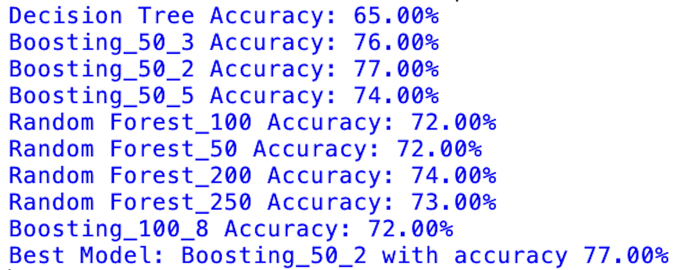

# 💳 Credit Default Prediction Pipeline

## 📊 Overview

- End-to-end pipeline for credit default prediction using Python and scikit-learn.
- The pipeline includes data preprocessing, model training, model selection, and batch scoring of new incoming data.
---
## 🎯 Objectives

- Preprocess and encode raw credit data (~1000 observations)
- Train and compare multiple classification models
- Select and save the best-performing model
- Score new incoming data with predictions and probability estimates
  
---

## 🔧 Tools Used
- Python
- pandas
- scikit-learn
- joblib
  
---

## ⚙️ Pipeline

### 🔹 Model Training (`train_model.py`)

- Loaded dataset from `credit.csv`
- Split predictors and target variable (`default`)
- Applied one-hot encoding to categorical variables
- Trained multiple models:
  - Decision Tree
  - Random Forest
  - AdaBoost
- Compared model performance using accuracy
- Selected the best-performing model
- Saved:
- Trained model → `artifacts/model.pkl`
- Feature structure → `artifacts/feature_columns.pkl`
  
---
### 🔹 Batch Scoring (`score_batch.py`)

- Loaded new data from `incoming_credit.csv`
- Applied the same encoding used during training
- Ensured feature consistency using column alignment
- Generated:
  - predictions (`pred_default`)
  - probability scores (`pred_probability`)
- Saved results to `incoming_scored.csv`
  
---
## 📊 Model Performance

The models were evaluated based on accuracy, and the best-performing model was selected for deployment.

---

## 📄 Sample Output

| pred_default | pred_probability |
|--------------|------------------|
| 0            | 0.23             |
| 1            | 0.78             |

---

## 📁 Files
- `train_model.py` → model training pipeline
- `score_batch.py` → batch prediction pipeline
- `incoming_scored.csv` → output with predictions and probabilities
- `artifacts/model.pkl` → saved trained model
- `artifacts/feature_columns.pkl` → saved feature structure

---

## 🚀 Skills Demonstrated
- Data preprocessing and feature engineering
- Classification modeling
- Model comparison and selection
- Model persistence using joblib
- End-to-end batch prediction pipeline
